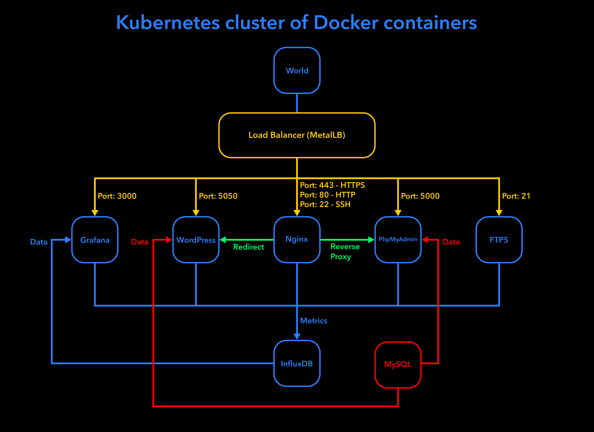

## About

The project consists of setting up an infrastructure of different services using Kubernetes multi-service cluster. You will need to set up a multi-service cluster.

Each service runs in its own dedicated Alpine Linux container bearing its name and built with a Dockerfile called in setup.sh.

The project includes:

• A Kubernetes web dashboard for managing the cluster

• A Load Balancer which manages the external access of the services. It is the only entry point of the cluster.

• A WordPress website listening on port 5050, which works with a MySQL database running in a separate container. The WordPress website runs in its own nginx server and has several users and an administrator.

• phpMyAdmin in its own nginx server, listening on port 5000 and linked with the MySQL database.

• A container with an nginx server listening on ports 80 and 443. Port 80 is in http and is a systematic redirection of type 301 to 443, which is in https.

• A FTPS server listening on port 21.

• A Grafana platform, listening on port 3000, linked with an InfluxDB database.
Grafana monitors all containers and includes a dashboard for each service. InfluxDB and grafana are in two distincts containers.

• All containers restart in case of a crash or stop of one of its component parts.
